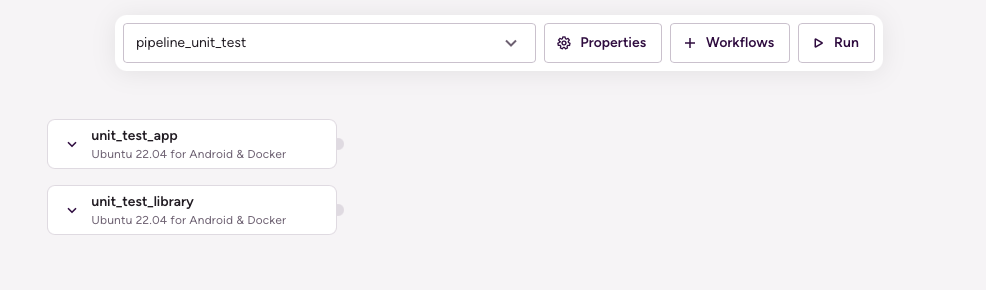

# (Android) Unit test sharding by module

## Description

Running the unit tests of a modularized app in parallel Workflows utilizing Pipelines.

This Pipeline contains one Stage — `stage_unit_test` — that executes two Workflows in parallel:

1. `unit_test_app`: This Workflow runs the unit tests of the `app` module using the `android-unit-test` Step.
1. `unit_test_library`: This Workflow runs the unit tests of the `lib-example` module using the `android-unit-test` Step.



## Instructions

To test this configuration in a new Bitrise example project, do the following:

1. Visit the [Create New App page](https://app.bitrise.io/apps/add) to create a new App.
1. When prompted to select a git repository, choose **Other/Manual** and paste the sample project repository URL (`https://github.com/bitrise-io/Bitrise-Android-Modules-Sample.git`) in the **Git repository (clone) URL** field.
1. Confirm that this is a public repository in the resulting pop-up.
1. Select the `main` branch to scan.
1. Wait for the project scanner to complete.
1. Enter `app` as the specified module.
1. Enter `debug` as the specified variant.
1. Continue through the prompts as normal — no changes are needed.
1. Open the new Bitrise project’s Workflow Editor.
1. Go to the **bitrise.yml** tab, and replace the existing yaml contents with the contents of the example `bitrise.yml` below.
1. Click the **Start/Schedule a Build** button, and select the `pipeline_unit_test` option in the **Workflow, Pipeline** dropdown menu at the bottom of the popup.

## bitrise.yml

```yaml
format_version: "11"
default_step_lib_source: https://github.com/bitrise-io/bitrise-steplib.git
project_type: android

meta:
  bitrise.io:
    stack: linux-docker-android-20.04
    machine_type_id: standard

pipelines:
  pipeline_unit_test:
    stages:
    - stage_unit_test: { }

stages:
  stage_unit_test:
    workflows:
    - unit_test_app: { }
    - unit_test_library: { }

workflows:
  unit_test_app:
    envs:
    - MODULE: app
    - VARIANT: debug
    after_run:
    - _test

  unit_test_library:
    envs:
    - MODULE: lib-example
    after_run:
    - _test

  _test:
    steps:
    - git-clone@6: { }
    - android-unit-test@1:
        inputs:
        - module: $MODULE
        - variant: $VARIANT
```
