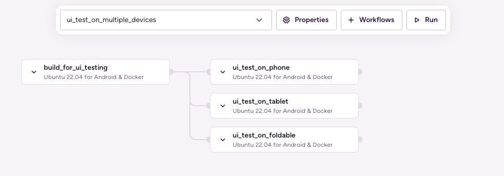

# (Android) Run UI tests in parallel on multiple devices or shards

## Description

Running the UI or instrumented tests of a single module in parallel Workflows utilizing Pipelines. You can run the tests in parallel by shards or by devices.

The Pipeline contains two Stages that are run serially:

1. `build_for_ui_testing`: This Stage executes a Workflow — also named `build_for_ui_testing` — that runs the `android-build-for-ui-testing` Step to build APKs for use in testing, and runs the `deploy-to-bitrise-io` Step to save those APKs for use in the later Stages. Performing this Stage separately from the actual testing allows for each test Stage to use these pre-built APKs rather than having to rebuild them for each test Stage.
1. `run_ui_tests_on_devices`: This Stage executes three UI test Workflows in parallel — `ui_test_on_phone`, `ui_test_on_tablet`, `ui_test_on_foldable` — which use the `android-instrumented-test` Step to run the UI tests on the APKs built in the previous Worflow on each specific device type.



## Instructions

To test this configuration in a new Bitrise example project, do the following:

1. Visit the [Create New App page](https://app.bitrise.io/apps/add) to create a new App.
1. When prompted to select a git repository, choose **Other/Manual** and paste the sample project repository URL (`https://github.com/bitrise-io/Bitrise-Android-Modules-Sample.git`) in the **Git repository (clone) URL** field.
1. Confirm that this is a public repository in the resulting pop-up.
1. Select the `main` branch to scan.
1. Wait for the project scanner to complete.
1. Enter `app` as the specified module.
1. Enter `debug` as the specified variant.
1. Continue through the prompts as normal — no changes are needed.
1. Open the new Bitrise project’s Workflow Editor.
1. Go to the **bitrise.yml** tab, and replace the existing yaml contents with the contents of the example `bitrise.yml` below.
1. Click the **Start/Schedule a Build** button, and select the `ui_test_on_multiple_devices` option in the **Workflow, Pipeline** dropdown menu at the bottom of the popup.

## bitrise.yml

```yaml
format_version: "11"
default_step_lib_source: https://github.com/bitrise-io/bitrise-steplib.git
project_type: android

meta:
  bitrise.io:
    stack: linux-docker-android-20.04
    machine_type_id: standard

pipelines:
  ui_test_on_multiple_devices:
    stages:
    - build_for_ui_testing: { }
    - run_ui_tests_on_devices: { }

stages:
  build_for_ui_testing:
    workflows:
    - build_for_ui_testing: { }

  run_ui_tests_on_devices:
    workflows:
    - ui_test_on_phone: { }
    - ui_test_on_tablet: { }
    - ui_test_on_foldable: { }

workflows:
  build_for_ui_testing:
    steps:
    - git-clone: { }
    - android-build-for-ui-testing:
        inputs:
        - module: app
        - variant: debug
    - deploy-to-bitrise-io: { }

  ui_test_on_phone:
    envs:
    - EMULATOR_PROFILE: pixel_5
    before_run:
    - _pull_apks
    after_run:
    - _run_tests

  ui_test_on_tablet:
    envs:
    - EMULATOR_PROFILE: 10.1in WXGA (Tablet)
    before_run:
    - _pull_apks
    after_run:
    - _run_tests

  ui_test_on_foldable:
    envs:
    - EMULATOR_PROFILE: 8in Foldable
    before_run:
    - _pull_apks
    after_run:
    - _run_tests

  _pull_apks:
    steps:
    - git::https://github.com/bitrise-steplib/bitrise-step-artifact-pull.git@main:
        inputs:
        - artifact_sources: build_for_ui_testing.build_for_ui_testing.*
        - export_map: |-
            BITRISE_APK_PATH: .*app-debug.apk
            BITRISE_TEST_APK_PATH: .*app-debug-androidTest.apk

  _run_tests:
    steps:
    - avd-manager:
        inputs:
        - profile: $EMULATOR_PROFILE
    - wait-for-android-emulator: { }
    - android-instrumented-test: { }
```
