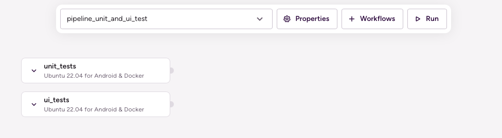

# (Android) Run unit and UI tests in parallel

## Description

Running unit tests and UI tests in parallel utilizing Pipelines.

This Pipeline contains two Workflows which are executed in parallel:

1. `unit_tests`: This Workflow simply runs the unit tests of the given module and variant using the `android-unit-test` Step.
1. `ui_tests`: This Workflow builds the given module and variant using the `android-build-for-ui-testing` Step, spins up an emulator using the `avd-manager` Step, waits for the emulator to boot using the `wait-for-android-emulator` Step, and runs the UI tests using the `android-instrumented-test` Step.



## Instructions

To test this configuration in a new Bitrise example project, do the following:

1. Visit the [Create New App page](https://app.bitrise.io/apps/add) to create a new App.
1. When prompted to select a git repository, choose **Other/Manual** and paste the sample project repository URL (`https://github.com/bitrise-io/Bitrise-Android-Modules-Sample.git`) in the **Git repository (clone) URL** field.
1. Confirm that this is a public repository in the resulting pop-up.
1. Select the `main` branch to scan.
1. Wait for the project scanner to complete.
1. Enter `app` as the specified module.
1. Enter `debug` as the specified variant.
1. Continue through the prompts as normal — no changes are needed.
1. Open the new Bitrise project’s Workflow Editor.
1. Go to the **bitrise.yml** tab, and replace the existing yaml contents with the contents of the example `bitrise.yml` below.
1. Click the **Start/Schedule a Build** button, and select the `pipeline_unit_and_ui_test` option in the **Workflow, Pipeline** dropdown menu at the bottom of the popup.

## bitrise.yml

```yaml
format_version: "17"
default_step_lib_source: https://github.com/bitrise-io/bitrise-steplib.git
project_type: android

meta:
  bitrise.io:
    stack: linux-docker-android-22.04
    machine_type_id: standard

pipelines:
  pipeline_unit_and_ui_test:
    workflows:
      unit_tests: {}
      ui_tests: {}

workflows:
  unit_tests:
    steps:
    - git-clone@8: {}
    - android-unit-test@1:
        inputs:
        - module: app
        - variant: debug

  ui_tests:
    steps:
    - git-clone@8: {}
    - android-build-for-ui-testing@0:
        inputs:
        - module: app
        - variant: debug
    - avd-manager@1: {}
    - wait-for-android-emulator@1: {}
    - android-instrumented-test@0: {}
```
