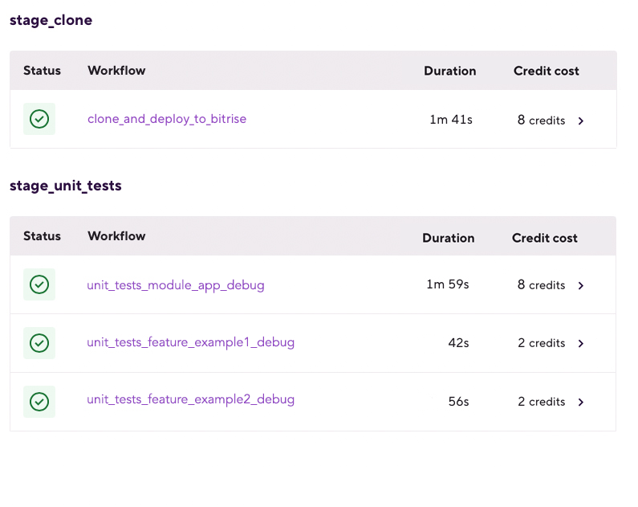

# (Android) Run unit and UI tests in parallel in a multimodule project

## Description

Running unit tests in several modules in parallel utilizing Pipelines.

This Pipeline contains two Stages:
 - `stage_clone` — where the repository get cloned, zipped and deployed (via `intermediate files`) to Bitrise, to be accessible from each module. 
 - `stage_unit_tests` — that executes three Workflows in parallel (`unit_tests_module_app_debug`, `unit_tests_feature_example1_debug` and `unit_tests_module_feature_example2_debug`). 

In each of these four workflows, two utility Workflows will be run sequentially: 
1. `_pull_intermediate_files`: This utility Workflow pull the intermediate files deployed in the `stage_clone` and unzips the result (which is the cloned repository).
2. `_unit_tests`: This utility Workflow runs the tests for the module and variant specified.

 

## Instructions

To test this configuration in a new Bitrise example project, do the following:

1. Visit the [Create New App page](https://app.bitrise.io/apps/add) to create a new App.
1. When prompted to select a git repository, choose **Other/Manual** and paste the sample project repository URL (`https://github.com/bitrise-io/Bitrise-Android-Modules-Sample.git`) in the **Git repository (clone) URL** field.
1. Confirm that this is a public repository in the resulting pop-up.
1. Select the `main` branch to scan.
1. Wait for the project scanner to complete.
1. Enter `app` as the specified module.
1. Enter `debug` as the specified variant.
1. Continue through the prompts as normal — no changes are needed.
1. Open the new Bitrise project’s Workflow Editor.
1. Go to the **bitrise.yml** tab, and replace the existing yaml contents with the contents of the example `bitrise.yml` below.
1. Click the **Start/Schedule a Build** button, and select the `pipeline_unit_tests_multimodule` option in the **Workflow, Pipeline** dropdown menu at the bottom of the popup.

## bitrise.yml

```yaml
format_version: "11"
default_step_lib_source: https://github.com/bitrise-io/bitrise-steplib.git
project_type: android

meta:
  bitrise.io:
    stack: linux-docker-android-20.04
    machine_type_id: standard

pipelines:
  pipeline_unit_tests_multimodule:
    stages:
    - stage_clone: {}
    - stage_unit_tests: {}

stages:
  stage_clone:
    workflows:
    - clone_and_deploy_to_bitrise: {}
  stage_unit_tests:
    workflows:
    - unit_tests_module_app_debug: {}
    - unit_tests_feature_example1_debug: {}
    - unit_tests_module_feature_example2_debug: {}

workflows:
  clone_and_deploy_to_bitrise:
    steps: 
    - git-clone: {}
    - cache-pull@2.7: {}
    - install-missing-android-tools@3.0:
        inputs:
        - gradlew_path: "./gradlew"
    - create-zip@0:
        inputs:
        - destination: "/bitrise/source"
        - source_path: "$BITRISE_SOURCE_DIR"
    - deploy-to-bitrise-io@2:
        inputs:
        - pipeline_intermediate_files: "/bitrise/source.zip:BITRISE_SOURCE_DIR_ZIP"

  unit_tests_module_app_debug:
    envs:
    - MODULE: app
    - VARIANT: debug
    before_run:
    - _pull_intermediate_files
    after_run:
    - _unit_tests
  unit_tests_feature_example1_debug:
    envs:
    - MODULE: feature:example1
    - VARIANT: debug
    before_run:
    - _pull_intermediate_files
    after_run:
    - _unit_tests
  unit_tests_module_feature_example2_debug:
    envs:
    - MODULE: feature:example2
    - VARIANT: debug
    before_run:
    - _pull_intermediate_files
    after_run:
    - _unit_tests 

  _pull_intermediate_files:
    steps:
    - pull-intermediate-files@1:
        inputs:
        - verbose: 'true'
    - unzip@0:
        inputs:
        - output_path: "$BITRISE_SOURCE_DIR"
        - archive_path: "$BITRISE_SOURCE_DIR_ZIP" 

  _unit_tests:
    steps:
    - android-unit-test@1:
        inputs:
        - module: "$MODULE"
        - project_location: "$BITRISE_SOURCE_DIR/src/"
        - variant: "$VARIANT"  
    - cache-push@2.7:
        inputs:
        - workdir: "$BITRISE_SOURCE_DIR/src/"
```
