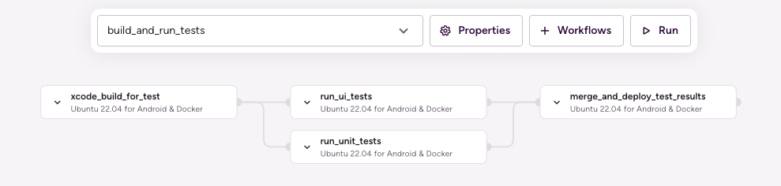

# (iOS) Merging test results and deploying to the Test Reports add-on

## Description

Test Reports add-on is tied to Bitrise builds. To make all the test reports generated in different builds appear on a single page in the add-on, the reports need to be merged and deployed in an additional build.

This example uses the [sample-swift-project-with-parallel-ui-test](https://github.com/bitrise-io/sample-swift-project-with-parallel-ui-test) iOS Open Source sample app and extends the ‘Run iOS test groups in parallel’ example Pipeline config with merging and deploying test results.

`run_ui_tests` and `run_unit_tests` Workflows are extended with a `deploy-to-bitrise-io` Step to make the generated test results available for the next Stage.

`run_tests_groups` Pipeline is extended with a new Stage: `deploy_test_results`.

This Stage runs the `deploy_test_results` Workflow:
1. `artifact-pull` Step downloads all the previous stage (`run_tests_groups`) generated zipped test results.
1. `script` Step unzips each test result into a new test run directory within the Test Report add-on deploy dir and creates the related `test-info.json` file.
1. `deploy-to-bitrise-io` Step deploys the merged test results.



## Instructions

1. Visit the [Create New App page](https://app.bitrise.io/apps/add) to create a new App.
1. When prompted to select a git repository, choose **Other/Manual** and paste the sample project repository URL (`https://github.com/bitrise-io/sample-swift-project-with-parallel-ui-test`) in the **Git repository (clone) URL** field.
1. Confirm that this is a public repository in the resulting pop-up.
1. Select the `master` branch to scan.
1. Wait for the project scanner to complete.
1. Select any of the offered Distribution methods (for example development, it does not really matter as now we are focusing on testing).
1. Confirm the offered stack, skip choosing the app icon and the webhook registration and kick off the first build.
1. Open the new Bitrise project’s Workflow Editor.
1. Go to the **bitrise.yml** tab and replace the existing `bitrise.yml` with the contents of the example bitrise.yml below.
1. Click the **Start/Schedule a Build** button, and select the `run_tests_groups` option in the **Workflow, Pipeline** dropdown menu at the bottom of the popup.
1. Open the Pipeline’s build page.
1. Select the `deploy_test_results` build.
1. Click on **Details & Add-ons** on the build details page and select the Test Reports add-on to view the merged test reports.

## bitrise.yml

```yaml
---
format_version: '11'
default_step_lib_source: https://github.com/bitrise-io/bitrise-steplib.git
project_type: ios

app:
  envs:
  - BITRISE_PROJECT_PATH: BullsEye.xcworkspace
  - BITRISE_SCHEME: BullsEye

meta:
  bitrise.io:
    stack: osx-xcode-13.2.x

pipelines:
  run_tests_groups:
    stages:
    - build_tests: {}
    - run_tests_groups: {}
    - deploy_test_results: {}

stages:
  build_tests:
    workflows:
    - build_tests: {}

  run_tests_groups:
    workflows:
    - run_ui_tests: {}
    - run_unit_tests: {}

  deploy_test_results:
    workflows:
    - deploy_test_results: {}

workflows:
  build_tests:
    steps:
    - git-clone@6: {}
    - xcode-build-for-test@2:
        inputs:
        - destination: generic/platform=iOS Simulator
    - deploy-to-bitrise-io@2:
        inputs:
        - pipeline_intermediate_files: "$BITRISE_TEST_BUNDLE_PATH:BITRISE_TEST_BUNDLE_PATH"

  run_ui_tests:
    before_run:
    - _pull_test_bundle
    steps:
    - xcode-test-without-building@0:
        inputs:
        - xctestrun: "$BITRISE_TEST_BUNDLE_PATH/BullsEye_UITests_iphonesimulator15.2-arm64-x86_64.xctestrun"
        - destination: platform=iOS Simulator,name=iPhone 12 Pro Max
    - deploy-to-bitrise-io@2:
        inputs:
        - pipeline_intermediate_files: "$BITRISE_XCRESULT_PATH:BITRISE_UI_TEST_XCRESULT_PATH"

  run_unit_tests:
    before_run:
    - _pull_test_bundle
    steps:
    - xcode-test-without-building@0:
        inputs:
        - xctestrun: "$BITRISE_TEST_BUNDLE_PATH/BullsEye_UnitTests_iphonesimulator15.2-arm64-x86_64.xctestrun"
        - destination: platform=iOS Simulator,name=iPhone 12 Pro Max
    - deploy-to-bitrise-io@2:
        inputs:
        - pipeline_intermediate_files: "$BITRISE_XCRESULT_PATH:BITRISE_UNIT_TEST_XCRESULT_PATH"

  deploy_test_results:
    steps:
    - pull-intermediate-files@1:
        inputs:
        - artifact_sources: run_tests_groups\..*
    - script@1:
        inputs:
        - content: |
            #!/usr/bin/env bash
            set -eo pipefail

            for item in "${BITRISE_UI_TEST_XCRESULT_PATH}" "${BITRISE_UNIT_TEST_XCRESULT_PATH}";
              do
                echo "Exporting ${item}"

                test_name=$(basename "$item" .xcresult)
                echo "Test name: $test_name"

                test_dir="${BITRISE_TEST_RESULT_DIR}/${test_name}"
                mkdir -p "${test_dir}"
                echo "Moving test result to: ${test_dir}"
                cp -R "${item}" "${test_dir}/$(basename ${item})"

                test_info="${test_dir}/test-info.json"
                echo "Creating Test info at: ${test_info}"
                echo "{ \"test-name\": \"${test_name}\" }" > "$test_info"
              done
    - deploy-to-bitrise-io@2: {}

  _pull_test_bundle:
    steps:
    - pull-intermediate-files@1:
        inputs:
        - artifact_sources: build_tests.build_tests
```
