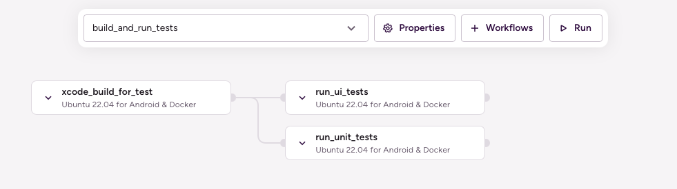

# (iOS) Run test groups in parallel

## Description

This example uses the [sample-swift-project-with-parallel-ui-test](https://github.com/bitrise-io/sample-swift-project-with-parallel-ui-test) iOS Open Source sample app, which has some example Unit and UI tests and uses Test Plans to group the tests.

**Note**: Xcode Test Plans provide a way to run a collection of tests with different test configurations. raywenderlich.com has a great [tutorial on how to get started with Xcode Test Plans](https://www.raywenderlich.com/10212963-xcode-test-plans-for-ios-getting-started).

The example Pipeline config showcases how to run different test groups in parallel.

`run_tests_groups` pipeline runs two Stages sequentially:
1. `build_tests` Stage that runs the `build_tests` Workflow. This Workflow git clones the sample project and runs the `xcode-build-for-test` Step to build the target and associated tests. The built test bundle is transferred to the next Stage (`run_tests_groups`) via the `deploy-to-bitrise-io` Step.
1. `run_tests_groups` Stage runs two Workflows in parallel: `run_ui_tests` and `run_unit_tests`. Both of these Workflows use the new `xcode-test-without-building` Step, which executes the tests based on the previous Stage built test bundle. The pre-built test bundle is pulled by the `_pull_test_bundle` utility Workflow.



## Instructions

1. Visit the [Create New App page](https://app.bitrise.io/apps/add) to create a new App.
1. When prompted to select a git repository, choose **Other/Manual** and paste the sample project repository URL (`https://github.com/bitrise-io/sample-swift-project-with-parallel-ui-test`) in the **Git repository (clone) URL** field.
1. Confirm that this is a public repository in the resulting pop-up.
1. Select the `master` branch to scan.
1. Wait for the project scanner to complete.
1. Select any of the offered Distribution methods (for example development, it does not really matter as now we are focusing on testing).
1. Confirm the offered stack, skip choosing the app icon and the webhook registration and kick off the first build.
1. Open the new Bitrise project’s Workflow Editor.
1. Go to the **bitrise.yml** tab and replace the existing `bitrise.yml` with the contents of the example bitrise.yml below.
1. Click the **Start/Schedule a Build** button, and select the `run_tests_groups` option in the **Workflow, Pipeline** dropdown menu at the bottom of the popup.


## bitrise.yml

```yaml
---
format_version: '11'
default_step_lib_source: https://github.com/bitrise-io/bitrise-steplib.git
project_type: ios

app:
  envs:
  - BITRISE_PROJECT_PATH: BullsEye.xcworkspace
  - BITRISE_SCHEME: BullsEye

meta:
  bitrise.io:
    stack: osx-xcode-13.2.x

pipelines:
  run_tests_groups:
    stages:
    - build_tests: {}
    - run_tests_groups: {}

stages:
  build_tests:
    workflows:
    - build_tests: {}

  run_tests_groups:
    workflows:
    - run_ui_tests: {}
    - run_unit_tests: {}

workflows:
  build_tests:
    steps:
    - git-clone@6: {}
    - xcode-build-for-test@2:
        inputs:
        - destination: generic/platform=iOS Simulator
    - deploy-to-bitrise-io@2: {}

  run_ui_tests:
    before_run:
    - _pull_test_bundle
    steps:
    - xcode-test-without-building@0:
        inputs:
        - xctestrun: "$BITRISE_TEST_BUNDLE_PATH/BullsEye_UITests_iphonesimulator15.2-arm64-x86_64.xctestrun"
        - destination: platform=iOS Simulator,name=iPhone 12 Pro Max

  run_unit_tests:
    before_run:
    - _pull_test_bundle
    steps:
    - xcode-test-without-building@0:
        inputs:
        - xctestrun: "$BITRISE_TEST_BUNDLE_PATH/BullsEye_UnitTests_iphonesimulator15.2-arm64-x86_64.xctestrun"
        - destination: platform=iOS Simulator,name=iPhone 12 Pro Max

  _pull_test_bundle:
    steps:
    - artifact-pull@1:
        inputs:
        - export_map: 'BITRISE_TEST_BUNDLE_ZIP_PATH: .*\.zip'
        - artifact_sources: build_tests.build_tests.*
    - script@1:
        inputs:
        - content: |-
            #!/usr/bin/env bash
            set -e
            set -o pipefail

            unzip "$BITRISE_TEST_BUNDLE_ZIP_PATH" -d "./test_bundle"
            envman add --key "BITRISE_TEST_BUNDLE_PATH" --value "./test_bundle"
```
