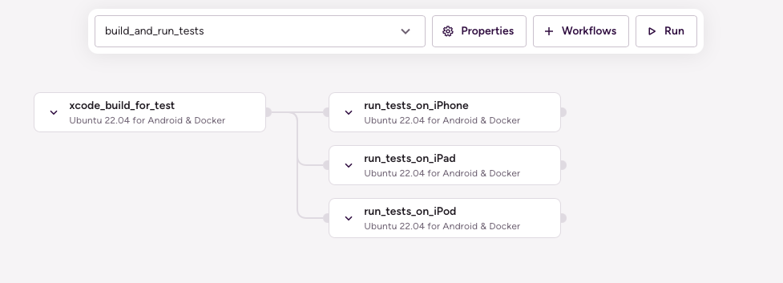

# (iOS) Run tests in parallel on multiple simulators

## Description

This example uses the [sample-swift-project-with-parallel-ui-test](https://github.com/bitrise-io/sample-swift-project-with-parallel-ui-test) iOS Open Source sample app, which has some example Unit and UI tests and uses Test Plans to group the tests.

The example Pipeline config showcases how to run all the test cases of the project on different iOS simulators.

`build_and_run_tests` Pipeline runs two Stages sequentially:
1. `build_tests` Stage that runs the `xcode_build_for_test` Workflow. This Workflow git clones the sample project and runs the `xcode-build-for-test` Step to build the target and associated tests. The built test bundle is transferred to the next Stage (`run_tests_on_simulators`) via the `deploy-to-bitrise-io` Step.

    **Note**: `xcode-build-for-test` Step compresses the built test bundle and moves the generated zip to the `$BITRISE_DEPLOY_DIR`, that directory’s content is deployed to the Workflow artifacts by default via the `deploy-to-bitrise-io` Step.

1. `run_tests` Stage runs three Workflows in parallel: `run_tests_on_iPhone`, `run_tests_on_iPad`, and `run_tests_on_iPod`. Both of these Workflows use the new `xcode-test-without-building` Step, which executes the tests based on the previous Stage built test bundle. The pre-built test bundle is pulled by the `_pull_test_bundle` utility Workflow.



## Instructions

1. Visit the [Create New App page](https://app.bitrise.io/apps/add) to create a new App.
1. When prompted to select a git repository, choose **Other/Manual** and paste the sample project repository URL (`https://github.com/bitrise-io/sample-swift-project-with-parallel-ui-test`) in the **Git repository (clone) URL** field.
1. Confirm that this is a public repository in the resulting pop-up.
1. Select the `master` branch to scan.
1. Wait for the project scanner to complete.
1. Select any of the offered Distribution methods (for example development, it does not really matter as now we are focusing on testing).
1. Confirm the offered stack, skip choosing the app icon and the webhook registration and kick off the first build.
1. Open the new Bitrise project’s Workflow Editor.
1. Go to the **bitrise.yml** tab and replace the existing `bitrise.yml` with the contents of the example bitrise.yml below.
1. Click the **Start/Schedule a Build** button, and select the `build_and_run_tests` option in the **Workflow, Pipeline** dropdown menu at the bottom of the popup.


## bitrise.yml

```yaml
---
format_version: '13'
default_step_lib_source: https://github.com/bitrise-io/bitrise-steplib.git
project_type: ios

app:
  envs:
  - BITRISE_PROJECT_PATH: BullsEye.xcworkspace
  - BITRISE_SCHEME: BullsEye

meta:
  bitrise.io:
    stack: osx-xcode-13.2.x

pipelines:
  build_and_run_tests:
    stages:
    - build_tests: {}
    - run_tests: {}

stages:
  build_tests:
    workflows:
    - xcode_build_for_test: {}

  run_tests:
    workflows:
    - run_tests_on_iPhone: {}
    - run_tests_on_iPad: {}
    - run_tests_on_iPod: {}

workflows:
  xcode_build_for_test:
    steps:
    - git-clone@8: {}
    - xcode-build-for-test@3:
        inputs:
        - destination: generic/platform=iOS Simulator
    - deploy-to-bitrise-io@2:
        inputs:
        - pipeline_intermediate_files: "$BITRISE_TEST_BUNDLE_PATH:BITRISE_TEST_BUNDLE_PATH"

  run_tests_on_iPhone:
    before_run:
    - _pull_test_bundle
    steps:
    - xcode-test-without-building@0:
        inputs:
        - xctestrun: "$BITRISE_TEST_BUNDLE_PATH/BullsEye_FullTests_iphonesimulator15.2-arm64-x86_64.xctestrun"
        - destination: platform=iOS Simulator,name=iPhone 12 Pro Max

  run_tests_on_iPad:
    before_run:
    - _pull_test_bundle
    steps:
    - xcode-test-without-building@0:
        inputs:
        - xctestrun: "$BITRISE_TEST_BUNDLE_PATH/BullsEye_FullTests_iphonesimulator15.2-arm64-x86_64.xctestrun"
        - destination: platform=iOS Simulator,name=iPad (9th generation)

  run_tests_on_iPod:
    before_run:
    - _pull_test_bundle
    steps:
    - xcode-test-without-building@0:
        inputs:
        - xctestrun: "$BITRISE_TEST_BUNDLE_PATH/BullsEye_FullTests_iphonesimulator15.2-arm64-x86_64.xctestrun"
        - destination: platform=iOS Simulator,name=iPod touch (7th generation)

  _pull_test_bundle:
    steps:
    - pull-intermediate-files@1:
        inputs:
        - artifact_sources: build_tests.xcode_build_for_test
```
